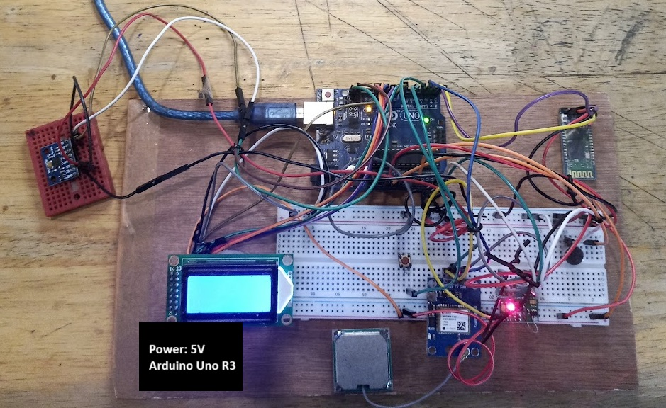
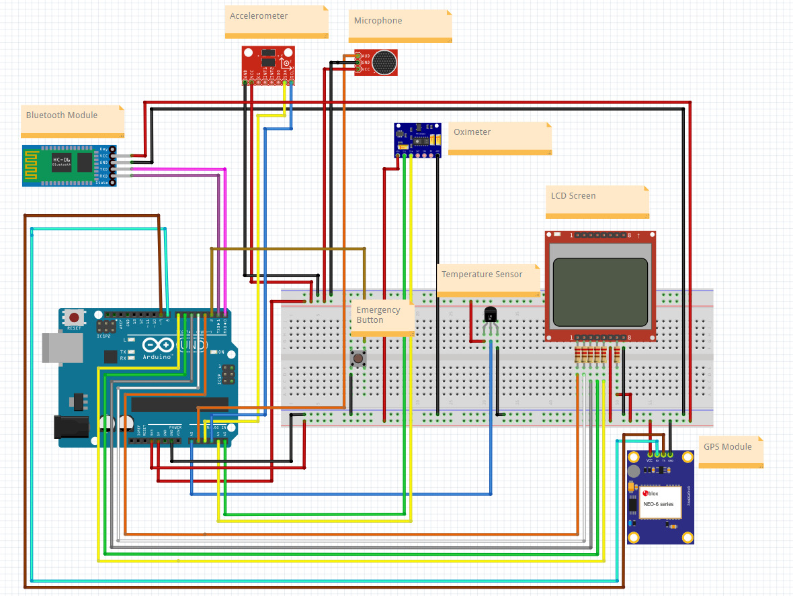
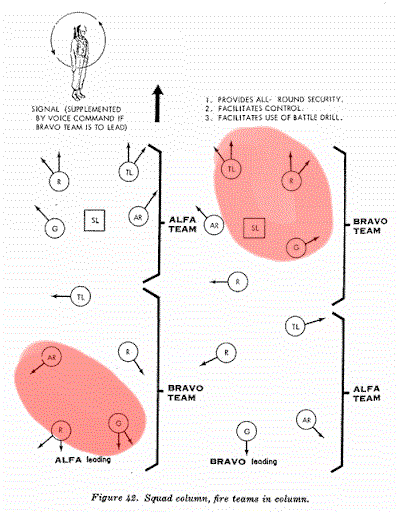
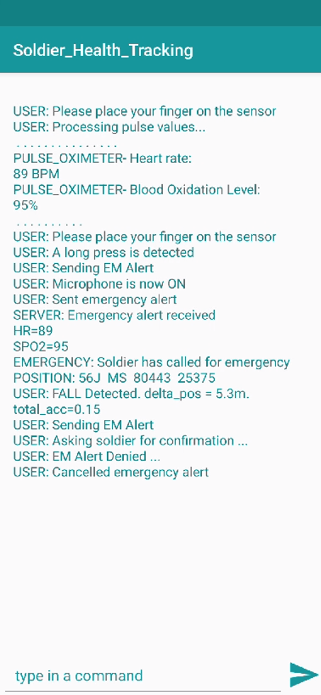
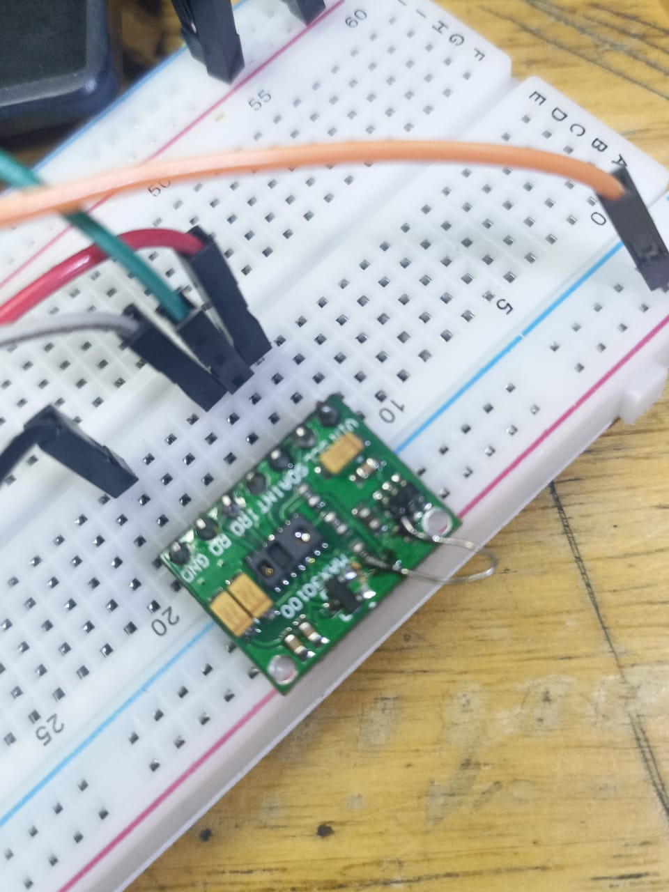
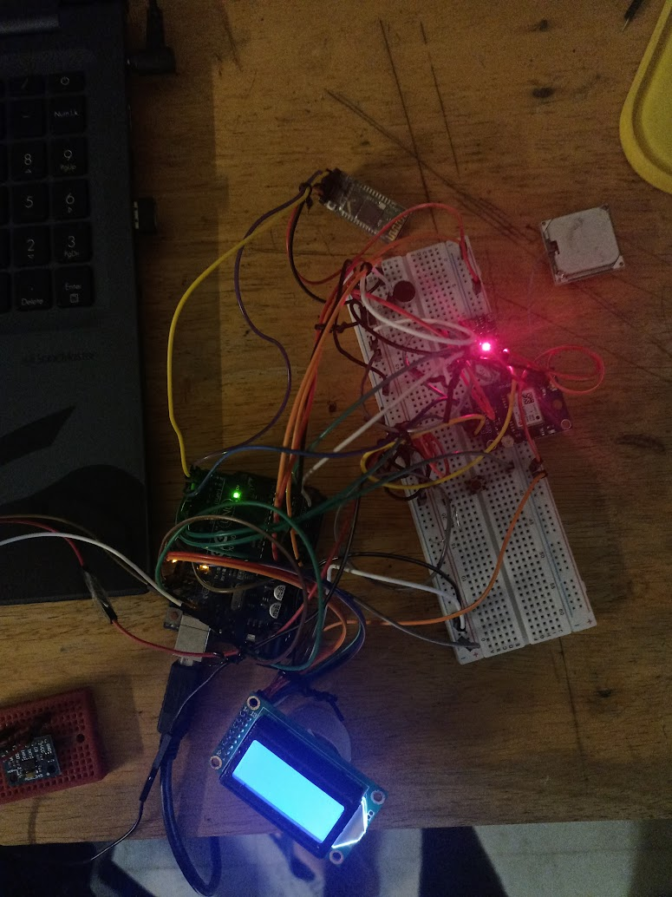

# Soldier Health Monitoring System

The proposed wearable device can be used for tracking soldier health vitals and using positional data for rescue and aid operations,
as well as strategizing movement of troops in the battlefield.

## Circuit Diagram

- HC05 Bluetooth Module
- ADXL345 Accelerometer
- MAX30100 Oximeter
- LM35 Temperature Sensor
- NEO-6M GPS Module

## Applications of wearable device

### Aid and Rescue Operations
- **Health Monitoring**: The oximeter and temperature sensor provide real-time Heart Rate, SpO2, and body temperature data measured at the wrist. (ex: [Wrist temperature measurement in Apple watch](https://support.apple.com/en-us/102674))
    - Heart Rate and SpO2 are computed using a weighted average algorithm.
    - Alerts are sent to the squadron system when vitals are critically low and the soldier hasn’t cancelled the emergency alert, including the conditions, `Unconsciousness`, `Extreme Fatigue`, or `Heavy Bleeding`.

- **Fall detection**: The accelerometer detects free fall by sensing the absence of Y-axis force. This is fine-tuned with GPS data, and an emergency alert is triggered upon detecting an extreme fall.

- **Emergency Button**: The push button sends emergency alerts when long-pressed, activating the microphone for the soldier to describe the situation.
    - A 5-second cancellation prompt is displayed on the LCD when an emergency alert is triggered, allowing the soldier to cancel it by pressing the button.

- The **Bluetooth module** facilitates communication with the squadron system. For extended range, a compatible `LoRa` module can replace it.

This system ensures timely aid by providing detailed health and positional data for injured soldiers.

### Strategization

By combining soldier health vitals and positional data, squadron leaders can pinpoint areas with injured or fatigued troops. This information supports better troop movement strategization and informed decision-making.

<figure>
  
  <figcaption align="center">Identification of injured troops. <a href="http://hardscrabblefarm.com/vn/combat-formations.html">Source</a></figcaption>
</figure>

<figure>
  
  <figcaption align="center">Data received on mobile application</figcaption>
</figure>

## Demo

https://github.com/user-attachments/assets/d9abfba4-487f-41f5-9d2e-7373ee0110a6

## Technical Notes

- MAX30100 Oximeter requires resoldering internal connections. [Guide](https://lastminuteengineers.com/max30100-pulse-oximeter-heart-rate-sensor-arduino-tutorial/)

- The NEO-6M GPS Module must be calibrated beforehand in an outdoor setting.
- The accelerometer must be calibrated seperately using `init_adxl()` and verifying the output values.

Here's an image of the intermediate circuit (●'◡'●)

